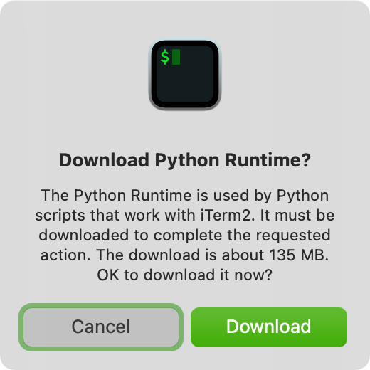

# Serenade for iTerm2

### Implementation

#### Shell integration

In the `bin` directory of [serenade-hyper](https://github.com/serenadeai/serenade-hyper/tree/main/bin), shell scripts based on [iTerm2's shell integration](https://iterm2.com/documentation-shell-integration.html) tells the shell to send additional escape codes that indicate the start and end of the prompt and output. This is automatically handled by iTerm to determine the prompt's contents and position on screen.

#### Layout

In `serenade.py`, when the script is launched in iTerm, a new instance of the `CommandHandler` class is created, along with the `Ipc` class needed to communicate with the client. iTerm provides a single global [Connection](https://iterm2.com/python-api/connection.html) API through which all requests with the terminal is made.

##### CommandHandler

`CommandHandler` currently supports two commands:
- `COMMAND_TYPE_GET_EDITOR_STATE`, which uses the [Prompt](https://iterm2.com/python-api/prompt.html), [Session](https://iterm2.com/python-api/session.html) and [Screen](https://iterm2.com/python-api/screen.html) API to get the source (draft command) and cursor
- `COMMAND_TYPE_DIFF`, which determines the adjustments to the source and cursor needed, and responds to the client to perform some subset of moving the cursor, deleting a number of characters, and inserting additional characters

## Installation

1. Download iTerm from https://iterm2.com/index.html.
1. Download `serenade-shell-integration.{bash,zsh}` from https://github.com/serenadeai/serenade-hyper/tree/main/bin to your home directory, and add `source ~/serenade-shell-integration.{bash,zsh}` to `.{bash,zsh}rc`.
1. Run `./install.sh` to symlink scripts here to iTerm's Scripts directory.
1. Restart iTerm, and you should automatically be prompted to install a Python runtime for scripts:
   
    - Alternatively, you can use the menu item under Scripts > Manage > Install Python Runtime.

## Development

1. After installation, use Scripts > Manage > console to restart the script and see output after making changes to files here.
